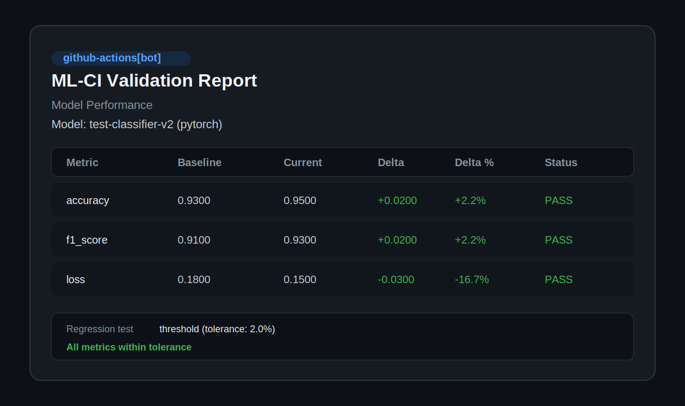

# ML-CI Action

ML CI/CD without platform lock-in. `ml-ci-action` compares model metrics against a baseline, optionally checks tabular data quality, optionally generates a model card, and posts an idempotent PR report with a single GitHub Action step.

It is designed for teams that want ML-aware CI on GitHub without adopting a hosted experiment platform first.



## What v0.1 Covers

- Threshold-based model regression detection
- Baseline comparison from a local file or the `main` / `master` branch
- Tabular data validation for CSV and Parquet
- Auto-generated model cards
- Idempotent PR comments via `<!-- ml-ci-report -->`

## What v0.1 Does Not Cover

- Hosted dashboards or persistent history
- Statistical significance tests (`wilcoxon`, `bootstrap`)
- Compliance exports
- Image- or text-specific data validation

## Quick Start

This first example is intentionally baseline-free so it works on the first PR in any repo.

```yaml
name: ML Validation

on:
  pull_request:

jobs:
  validate:
    runs-on: ubuntu-latest
    steps:
      - uses: actions/checkout@v4

      - name: Train or evaluate the candidate model
        run: python train.py --save-metrics metrics.json

      - name: Validate model changes
        uses: ml-ci/ml-ci-action@v0.1.0
        with:
          metrics-file: metrics.json
          comment-on-pr: "true"
          github-token: ${{ github.token }}
```

Once the same metrics file exists on `main` or `master`, enable branch comparison:

```yaml
      - name: Validate against the default branch baseline
        uses: ml-ci/ml-ci-action@v0.1.0
        with:
          metrics-file: metrics.json
          baseline-metrics: main
          regression-test: threshold
          regression-tolerance: "0.02"
          comment-on-pr: "true"
          github-token: ${{ github.token }}
```

## Metrics JSON Schema

`metrics-file` must point to a JSON object with a required `metrics` field.

```json
{
  "model_name": "fraud-detector-v2",
  "framework": "pytorch",
  "timestamp": "2026-03-28T10:30:00Z",
  "metrics": {
    "accuracy": 0.943,
    "f1": 0.891,
    "auc_roc": 0.967,
    "loss": 0.153
  },
  "dataset": {
    "name": "transactions-q1-2026",
    "version": "2026.03",
    "num_samples": 150000
  },
  "hyperparameters": {
    "learning_rate": 0.001,
    "epochs": 50,
    "batch_size": 32
  }
}
```

Rules:

- The top level must be a JSON object.
- `metrics` is required.
- Metric values must be numeric scalars.
- Comparisons use only the intersection of metric names in current and baseline payloads.
- Metrics with names like `loss`, `mse`, and `error` are treated as lower-is-better by default.

## Inputs

| Input | Required | Default | Description |
|---|---|---:|---|
| `metrics-file` | Yes |  | Path to current metrics JSON. |
| `baseline-metrics` | No | `""` | Local path to baseline metrics, or `main` / `master` to fetch the same path from the default branch. |
| `data-path` | No | `""` | Path to CSV or Parquet data for tabular quality checks. |
| `baseline-data-path` | No | `""` | Path to baseline data for schema and drift comparisons. |
| `drift-threshold` | No | `0.1` | Maximum PSI score before flagging drift. |
| `regression-test` | No | `threshold` | Regression method. Only `threshold` is supported in v0.1. |
| `regression-tolerance` | No | `0.02` | Maximum allowed per-metric degradation as a fraction of baseline. |
| `model-card` | No | `false` | Generate `MODEL_CARD.md`. |
| `fail-on-regression` | No | `true` | Exit non-zero when regression or data-quality failure is detected. |
| `comment-on-pr` | No | `true` | Post or update the PR report comment. |
| `framework` | No | `auto` | Framework hint for report metadata. |
| `github-token` | No | `${{ github.token }}` | Token used for PR comments and remote baseline fetches. |

## Outputs

| Output | Description |
|---|---|
| `validation-passed` | `true` when no regression or failing data issue was detected. |
| `regression-detected` | `true` when any shared metric regressed beyond tolerance. |
| `model-card-path` | Output path for the generated model card, if enabled. |
| `report-json` | JSON payload describing the validation result. |

## Example PR Report

```markdown
<!-- ml-ci-report -->

## :white_check_mark: ML-CI Validation Report

### Model Performance

**Model**: `fraud-detector-v2` (pytorch)

| Metric | Baseline | Current | Delta | Delta % | Status |
|--------|----------|---------|-------|---------|--------|
| accuracy | 0.9410 | 0.9430 | +0.0020 | +0.2% | :white_check_mark: |
| f1 | 0.8950 | 0.8910 | -0.0040 | -0.4% | :warning: |
| loss | 0.1600 | 0.1530 | -0.0070 | -4.4% | :white_check_mark: |

**Regression test**: `threshold` (tolerance: 2.0%)
**Result**: :white_check_mark: All metrics within tolerance
```

## Baseline Modes

`baseline-metrics` supports three modes:

- Local file path: compare against a checked-in artifact or prior run output.
- `main` or `master`: fetch the same metrics path from the named branch via the GitHub Contents API.
- Empty: skip baseline comparison and report current metrics only.

If the baseline file is missing on the branch, the action degrades gracefully to current-only reporting.

## Data Validation

When `data-path` is provided, ML-CI performs tabular checks:

- schema compatibility against `baseline-data-path`
- missing-value analysis
- duplicate-row detection
- numeric distribution drift via PSI

CSV and Parquet are supported in v0.1.

## Model Cards

When `model-card: "true"` is enabled, ML-CI writes `MODEL_CARD.md` using the current metrics payload plus optional comparison data.

## Launch-Grade Behavior Notes

- Remote baseline fetches that hit GitHub permission or Contents API size limits fall back to current-only mode with a targeted warning telling users to use a local file path for `baseline-metrics`.
- Example workflows under [`examples/`](./examples) are documentation assets; they are not executed automatically by this repository's CI.
- The repository's PR self-test workflow exercises current-only mode, remote `main` fetch fallback, local baseline comparison, expected regression failure, expected data-quality failure, and live PR comment posting.

## Positioning

ML-CI is intentionally standalone:

- No hosted server required
- No experiment-tracking vendor dependency
- No dashboard or billing flow in v0.1

If you already use a platform like ClearML, W&B, or MLflow, ML-CI is best thought of as a lightweight GitHub-native gate and reporting layer rather than a replacement for full experiment management.

## Honest Comparison

| Option | Strengths | Tradeoff |
|---|---|---|
| Manual scripts in Actions | Maximum flexibility | Rebuild reporting, baseline fetches, and PR comment plumbing yourself |
| Platform-bound integrations | Rich experiment history and dashboards | Requires adopting that vendor's server, account model, and workflow |
| `ml-ci-action` | One-step GitHub-native validation and reporting | No hosted history or compliance layer in v0.1 |

## Examples

- [PyTorch classification](./examples/pytorch-classification/.github/workflows/ml-ci.yml)
- [scikit-learn regression](./examples/sklearn-regression/.github/workflows/ml-ci.yml)

## Release Checklist

- `pytest -q`
- `docker build -t ml-ci-action .`
- container smoke test with fixture metrics
- GitHub PR self-test workflow green
- one launch asset is current
- Marketplace metadata reviewed
- manual rerun check confirms the PR comment updates in place instead of duplicating

See [docs/release-checklist.md](./docs/release-checklist.md) and [docs/launch-copy.md](./docs/launch-copy.md) for launch-day materials.

## Development

```bash
pytest -q
docker build -t ml-ci-action .
```

See [CONTRIBUTING.md](./CONTRIBUTING.md) for the local workflow.
