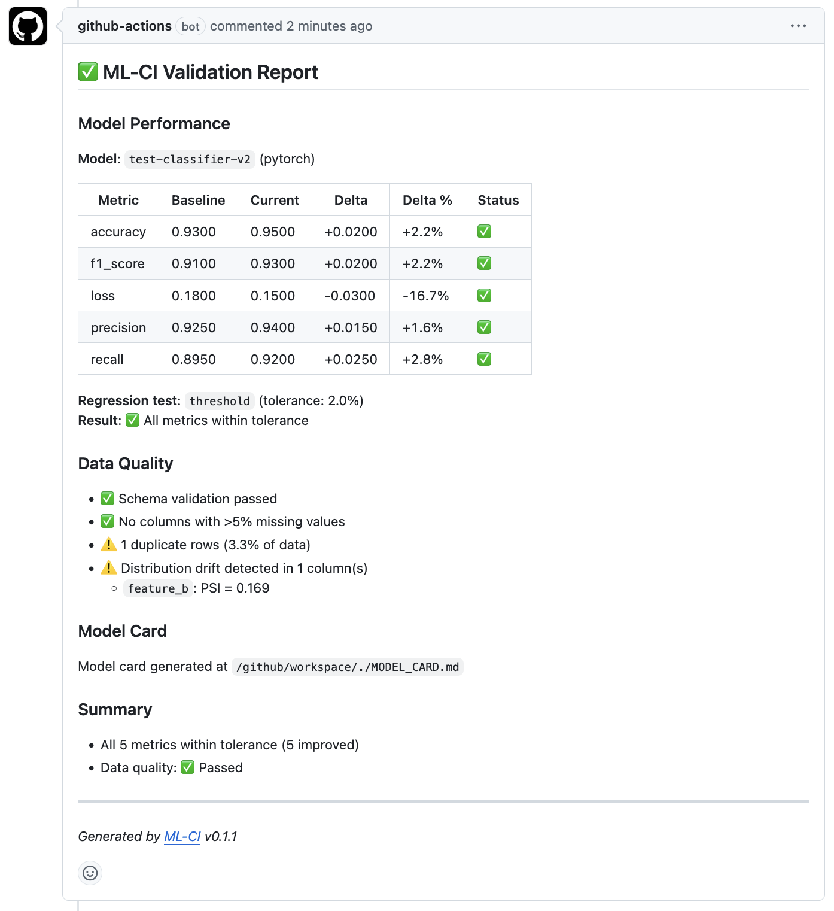

# ML-CI Action

GitHub-native ML validation for pull requests: compare metrics, check tabular data, generate a model card, and post one idempotent PR report.

- Compare current metrics against `main` or a checked-in baseline and fail CI on regression.
- Run CSV/Parquet data checks before model changes merge.
- Post one GitHub-native PR report with model performance, data quality, summary, and model card path.



_Real GitHub PR comment generated by ML-CI v0.2.3._

_Shown in GitHub light theme; the generated content is the same in dark theme._

Best for teams that want lightweight ML checks in GitHub Actions, not a full hosted MLOps platform.

## Why This Is Different

- No hosted service required
- No account or external platform dependency
- Works from a metrics JSON file plus optional tabular data input
- Posts directly into GitHub pull requests instead of a separate dashboard

## Current Limits

> - Tabular CSV/Parquet validation only
> - No hosted history, dashboards, or compliance exports

## Quick Start

This first example is intentionally baseline-free so it works on the first PR in any repo.

```yaml
name: ML Validation

on:
  pull_request:

jobs:
  validate:
    runs-on: ubuntu-latest
    steps:
      - uses: actions/checkout@v4

      - name: Train or evaluate the candidate model
        run: python train.py --save-metrics metrics.json

      - name: Validate model changes
        uses: ml-ci-labs/ml-ci-action@v0.2.3
        with:
          metrics-file: metrics.json
          comment-on-pr: "true"
          github-token: ${{ github.token }}
```

Once the same metrics file exists on `main` or `master`, enable branch comparison:

```yaml
      - name: Validate against the default branch baseline
        uses: ml-ci-labs/ml-ci-action@v0.2.3
        with:
          metrics-file: metrics.json
          baseline-metrics: main
          regression-test: threshold
          regression-tolerance: "0.02"
          comment-on-pr: "true"
          github-token: ${{ github.token }}
```

## Metrics JSON Schema

`metrics-file` must point to a JSON object with a required `metrics` field.

```json
{
  "model_name": "fraud-detector-v2",
  "framework": "pytorch",
  "timestamp": "2026-03-28T10:30:00Z",
  "metrics": {
    "accuracy": 0.943,
    "f1": 0.891,
    "auc_roc": 0.967,
    "loss": 0.153
  },
  "dataset": {
    "name": "transactions-q1-2026",
    "version": "2026.03",
    "num_samples": 150000
  },
  "hyperparameters": {
    "learning_rate": 0.001,
    "epochs": 50,
    "batch_size": 32
  }
}
```

Rules:

- The top level must be a JSON object.
- `metrics` is required.
- Metric values must be numeric scalars.
- Comparisons use only the intersection of metric names in current and baseline payloads.
- Metrics with names like `loss`, `mse`, and `error` are treated as lower-is-better by default.

## Statistical Regression Testing

For rigorous regression detection beyond simple thresholds, add per-fold observation vectors from cross-validation:

```json
{
  "model_name": "fraud-detector-v2",
  "framework": "pytorch",
  "metrics": {
    "accuracy": 0.943,
    "f1": 0.891
  },
  "observations": {
    "accuracy": [0.94, 0.95, 0.93, 0.94, 0.96, 0.93, 0.95, 0.94, 0.93, 0.95],
    "f1": [0.88, 0.90, 0.89, 0.88, 0.91, 0.88, 0.90, 0.89, 0.88, 0.90]
  }
}
```

Then choose a statistical method:

```yaml
      - name: Wilcoxon signed-rank test
        uses: ml-ci-labs/ml-ci-action@v0.2.3
        with:
          metrics-file: metrics.json
          baseline-metrics: main
          regression-test: wilcoxon
          alpha: "0.05"
```

```yaml
      - name: Bootstrap confidence intervals
        uses: ml-ci-labs/ml-ci-action@v0.2.3
        with:
          metrics-file: metrics.json
          baseline-metrics: main
          regression-test: bootstrap
          confidence: "0.95"
          n-bootstrap: "10000"
```

Both methods require `observations` in both current and baseline metrics files. The observation vectors must be the same length (paired samples from the same folds). At least 6 observations are recommended for the Wilcoxon test.

| Method | When to use | Regression detected when |
|--------|------------|--------------------------|
| `threshold` | Quick checks, single evaluation runs | Any metric drops by more than `regression-tolerance` |
| `wilcoxon` | Cross-validation with paired folds | Wilcoxon p-value < `alpha` and change is in the bad direction |
| `bootstrap` | Cross-validation, want confidence bounds | Entire CI is on the bad side of zero |

## Inputs

| Input | Required | Default | Description |
|---|---|---:|---|
| `metrics-file` | Yes |  | Path to current metrics JSON. |
| `baseline-metrics` | No | `""` | Local path to baseline metrics, or `main` / `master` to fetch the same path from the default branch. |
| `data-path` | No | `""` | Path to CSV or Parquet data for tabular quality checks. |
| `baseline-data-path` | No | `""` | Path to baseline data for schema and drift comparisons. |
| `drift-threshold` | No | `0.1` | Maximum PSI score before flagging drift. |
| `regression-test` | No | `threshold` | Regression method: `threshold`, `wilcoxon`, or `bootstrap`. |
| `regression-tolerance` | No | `0.02` | Maximum allowed per-metric degradation as a fraction of baseline (threshold method). |
| `alpha` | No | `0.05` | Significance level for Wilcoxon test. |
| `n-bootstrap` | No | `10000` | Number of bootstrap resamples. |
| `confidence` | No | `0.95` | Confidence level for bootstrap CI. |
| `higher-is-better` | No | `""` | JSON object mapping metric names to direction (`true` = higher is better). Overrides auto-inference. |
| `model-card` | No | `false` | Generate `MODEL_CARD.md`. |
| `fail-on-regression` | No | `true` | Exit non-zero when regression or data-quality failure is detected. |
| `comment-on-pr` | No | `true` | Post or update the PR report comment. |
| `framework` | No | `auto` | Framework hint for report metadata when the metrics file omits `framework` or reports `unknown`. |
| `github-token` | No | `${{ github.token }}` | Token used for PR comments and remote baseline fetches. |

## Outputs

| Output | Description |
|---|---|
| `validation-passed` | `true` when no regression or failing data issue was detected. |
| `regression-detected` | `true` when any shared metric regressed beyond tolerance. |
| `model-card-path` | Output path for the generated model card, if enabled. |
| `report-json` | JSON payload describing the validation result. |

## What Shows Up In The PR

The screenshot above is a real GitHub PR comment produced by ML-CI v0.2.3. Each run creates or updates one idempotent comment with the following sections:

| Section | What it shows |
|---|---|
| `Model Performance` | Baseline vs current metrics, absolute and percentage deltas, and per-metric pass/warn/fail status |
| `Statistical Details` | Wilcoxon p-values or bootstrap CI bounds in a collapsible block (when using statistical tests) |
| `Data Quality` | Schema checks, missing-value warnings, duplicate detection, and numeric drift findings |
| `Model Card` | The generated `MODEL_CARD.md` path when model card output is enabled |
| `Summary` | A compact gate result for model regression and data quality |

That keeps the review loop inside GitHub: reviewers can see whether the PR improved the model, introduced drift, or needs follow-up without leaving the pull request.

<details>
<summary>Raw comment markdown example (threshold)</summary>

```markdown
<!-- ml-ci-report -->

## :white_check_mark: ML-CI Validation Report

### Model Performance

**Model**: `fraud-detector-v2` (pytorch)

| Metric | Baseline | Current | Delta | Delta % | Status |
|--------|----------|---------|-------|---------|--------|
| accuracy | 0.9300 | 0.9500 | +0.0200 | +2.2% | :white_check_mark: |
| f1_score | 0.9100 | 0.9300 | +0.0200 | +2.2% | :white_check_mark: |
| loss | 0.1800 | 0.1500 | -0.0300 | -16.7% | :white_check_mark: |

**Regression test**: `threshold` (tolerance: 2.0%)
**Result**: :white_check_mark: All metrics within tolerance

### Summary

- All 3 metrics within tolerance (3 improved)

---
*Generated by [ML-CI](https://github.com/ml-ci-labs/ml-ci-action) v0.2.3*
```

</details>

<details>
<summary>Raw comment markdown example (Wilcoxon)</summary>

```markdown
<!-- ml-ci-report -->

## :white_check_mark: ML-CI Validation Report

### Model Performance

**Model**: `fraud-detector-v2` (pytorch)

| Metric | Baseline | Current | Delta | Delta % | Status |
|--------|----------|---------|-------|---------|--------|
| accuracy | 0.9320 | 0.9520 | +0.0200 | +2.1% | :white_check_mark: |
| f1 | 0.8920 | 0.9120 | +0.0200 | +2.2% | :white_check_mark: |
| loss | 0.1780 | 0.1480 | -0.0300 | -16.9% | :white_check_mark: |

**Regression test**: `wilcoxon` (alpha: 0.05, n=5 folds)
**Result**: :white_check_mark: No statistically significant regression

<details>
<summary>Wilcoxon signed-rank test details (alpha = 0.05)</summary>

| Metric | p-value | Median Diff | Significant | Regressed |
|--------|---------|-------------|-------------|-----------|
| accuracy | 0.0625 | +0.0200 | No | No |
| f1 | 0.0625 | +0.0200 | No | No |
| loss | 0.0625 | -0.0300 | No | No |

</details>

### Summary

- All 3 metrics passed Wilcoxon test (3 improved)

---
*Generated by [ML-CI](https://github.com/ml-ci-labs/ml-ci-action) v0.2.3*
```

</details>

## Baseline Modes

`baseline-metrics` supports three modes:

- Local file path: compare against a checked-in artifact or prior run output.
- `main` or `master`: fetch the same metrics path from the named branch via the GitHub Contents API.
- Empty: skip baseline comparison and report current metrics only.

If the baseline file is missing on the branch, the action degrades gracefully to current-only reporting.

## Data Validation

When `data-path` is provided, ML-CI performs tabular checks:

- schema compatibility against `baseline-data-path`
- missing-value analysis
- duplicate-row detection
- numeric distribution drift via PSI

CSV and Parquet are supported in v0.2.3.

## Model Cards

When `model-card: "true"` is enabled, ML-CI writes `MODEL_CARD.md` using the current metrics payload plus optional comparison data.

## Positioning

ML-CI is intentionally standalone:

- No hosted server required
- No experiment-tracking vendor dependency
- No dashboard or billing flow in v0.2.3

If you already use a platform like ClearML, W&B, or MLflow, ML-CI is best thought of as a lightweight GitHub-native gate and reporting layer rather than a replacement for full experiment management.

## Honest Comparison

| Option | Strengths | Tradeoff |
|---|---|---|
| Manual scripts in Actions | Maximum flexibility | Rebuild reporting, baseline fetches, and PR comment plumbing yourself |
| Platform-bound integrations | Rich experiment history and dashboards | Requires adopting that vendor's server, account model, and workflow |
| `ml-ci-action` | One-step GitHub-native validation and reporting | No hosted history or compliance layer in v0.2.3 |

## Examples

- [First pull request, no baseline yet](./examples/pytorch-classification/.github/workflows/ml-ci.yml)
- [Default-branch baseline comparison](./examples/sklearn-regression/.github/workflows/ml-ci.yml)
- [Cross-validation with Wilcoxon test](./examples/cross-validation/.github/workflows/ml-ci.yml)

The example workflows are reference examples. They are not CI jobs that run automatically inside this repository.

## Launch-Grade Behavior Notes

- Remote baseline fetches that hit GitHub permission or Contents API size limits fall back to current-only mode with a targeted warning telling users to use a local file path for `baseline-metrics`.
- The repository's PR self-test workflow exercises current-only mode, remote `main` fetch fallback, local baseline comparison, expected regression failure, expected data-quality failure, and live PR comment posting.

## Release Checklist

- `uv run pytest -q`
- `docker build -t ml-ci-action .`
- container smoke test with fixture metrics
- GitHub PR self-test workflow green
- release workflow smoke test against the published GHCR image green
- one launch asset is current
- Marketplace metadata reviewed
- manual rerun check confirms the PR comment updates in place instead of duplicating

See [docs/release-checklist.md](./docs/release-checklist.md) for release-day checks.

## Marketplace Metadata

- Listing title: `ML CI - Model Validation`
- About text: `GitHub-native ML validation for pull requests: compare metrics, check tabular data, generate model cards, and post one idempotent PR report.`
- Suggested topics: `mlops`, `machine-learning`, `github-actions`, `ci-cd`, `model-validation`, `data-quality`, `model-cards`, `pytorch`, `scikit-learn`, `ml-ci`

## Development

```bash
uv sync --frozen --group dev
uv run pytest -q
docker build -t ml-ci-action .
```

See [CONTRIBUTING.md](./CONTRIBUTING.md) for the local workflow.
